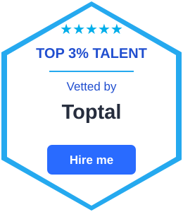

# Hi, I'm Kartheek 👋

### Senior DevOps & Cloud Engineer

I build and operate reliable cloud infrastructure, CI/CD platforms, and containerized workloads across AWS and Microsoft Azure.

### ☁️ Core Expertise

- AWS & Microsoft Azure
- Kubernetes, Amazon EKS & AKS
- Terraform & Infrastructure as Code
- Jenkins, GitHub Actions & Azure DevOps
- Docker & container platforms
- Prometheus, Grafana & CloudWatch
- IAM, KMS, Azure Key Vault & DevSecOps
- Python & Bash automation

### 🚀 What I Work On

- Cloud infrastructure automation
- CI/CD pipeline engineering
- Kubernetes platform operations
- Infrastructure as Code
- Cloud security and access management
- Monitoring and observability
- Production troubleshooting and incident resolution
- Automation and operational reliability

### 🏆 Toptal

### 🛠️ Technologies

`AWS` `Azure` `Kubernetes` `Amazon EKS` `AKS` `Docker` `Terraform`

`Jenkins` `GitHub Actions` `Azure DevOps` `Helm` `ArgoCD`

`Prometheus` `Grafana` `CloudWatch` `Azure Monitor`

`Python` `Bash` `Git` `Linux` `CI/CD` `DevSecOps`

### 📍 Location

Bengaluru, India
